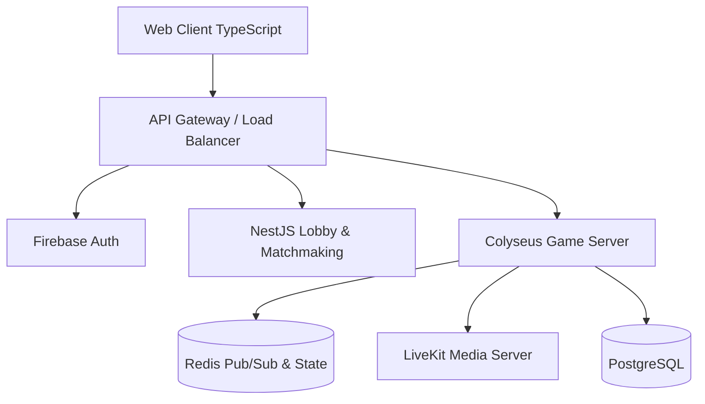

# Software Design Document (SDD) - LudoVerse

## 1. High-Level Architecture
LudoVerse utilizes a microservices-inspired architecture with an authoritative real-time game server.

## 2. Component Details
- **Web Client (TypeScript/Vite)**: Handles rendering, UI/UX (glassmorphism, CSS/Canvas motion), audio (Web Audio), and network synchronization (colyseus.js). Wraps to Android via Capacitor. Unity was dropped because its Editor does not run on Android; see `docs/HANDOFF.md`.
- **Gateway/API**: Built with NestJS. Handles user profiles, economy, shop, leaderboards, and matchmaking ticket generation.
- **Colyseus Game Server**: Handles strict authoritative gameplay. Move validation, dice roll generation (server-side RNG), turn timers, and win states.
- **LiveKit Server**: Manages WebRTC UDP streams for low-latency voice and video chat.
- **Redis**: Acts as the central nervous system for matchmaking queues, session management, and Colyseus presence.
- **PostgreSQL**: Long-term persistence. Stores user accounts, transaction logs, match history, and social graphs.

## 3. Game State Flow
`Lobby -> Matchmaking -> Loading -> Dice Roll -> Player Turn -> Move Validation -> Animation -> Win Check -> Reward -> Exit`

## 4. Design Patterns
- **Client**: Module-scoped state, async/await, and pooled DOM/Canvas nodes.
- **Backend**: CQRS, Repository Pattern (TypeORM/Prisma), Event-Driven architecture for real-time state.
